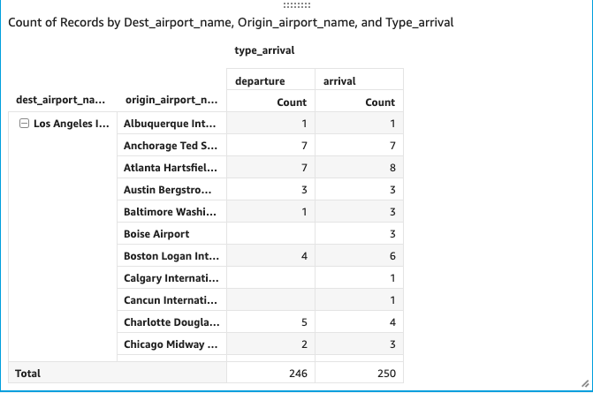

# AirPool by Tridha Chaudhuri

## Table of Contents

1. [Problem](README.md#problem)
2. [Project Idea](README.md#project-idea)
3. [Data](README.md#data)
4. [Use Case](README.md#use-case)
5. [Framework](README.md#framework)
6. [Demo](README.md#demo) 
7. [Engineering Challenges](README.md#engineering-challenges)
8. [Future Work](README.md#future-work)
9. [Contact Information](README.md#contact-information)

## Problem 

The growth of an organization steadily leads to more data or rather big data which is stored across a number of locations and formats including relational databases, NoSQL databases, and logs. This data can be used to gain big insights and drive relevant actions and operations to achieve whatever outcome: big data analytics with a purpose; smart data for smart applications – and inevitably artificial intelligence to make sense of all that data. As more data is collected by an organization, the data landscape becomes increasingly fragmented, complex, and siloed and using a data warehouse alone become insufficient. 

<b> Solution: </b> 
Unlike relational engines and databases, which require highly structured data, Data Lakes enables organizations to store all kinds of data in an unstructured or semi-structured format. The cost of that storage is a tiny fraction of the cost of keeping it in a relational database. This has enabled organizations to hold onto much larger quantities of data than they could before. The data stored in the Data Lake are in its rawest form without needing to be converted and analyzed first.

Some [business benefits](https://www.smartdatacollective.com/business-and-technological-benefits-of-data-lakes/) of Data Lakes include:
* <b>Scalable: </b> 
  Unlike traditional data warehouse, Data Leaks offers scalability and is inexpensive as well
* <b>Versatile: </b> 
  A data lake can store both structured and unstructured data from diverse sources. In other words, it can store XML, logs, multimedia, sensor data, chat, social data, binary, and people data
* <b>Schema Flexibility: </b> 
  For traditional schema, you need to have your data in a structured format. Traditional data warehouse products are schema based. But for analytics, this could prove to be a glitch as the data needs to be analyzed in its raw form. Data Lake enables you to be schema free, or you could come up with multiple schemas for the same data. In short, it allows you to separate schema from data, which is good for analytics.

## Project Idea

To build a centralized data storage that can interoperate across multiple [unstructured and semi-structured data sets](README.md#data) as one “single” data lake, I used <b>historical and real time flight data</b>. Necessary raw data is then processed and is passed through a [data pipeline](README.md#framework) built on [Amazon Web Services](https://aws.amazon.com/big-data/datalakes-and-analytics/what-is-a-data-lake/) so that it is possible to discover and manage the data for operational analytics and visualization.

## Data

### Data Sources

#### 1. **pyflightdata API** 

  [pyflightdata API](https://pyflightdata.readthedocs.io/en/latest/about.html) is a python script that can be installed and imported through Python to automatically get data from flightradar24, a popular site to get data related to an airline or particular flight and analyze it. 
  For this project, pyflightdata API was used to get the following data:
  * list and details on countries, airlines and airport data 
  * all aircrafts arriving at a particular airport
  * all aircrafts departing from a particular airport
  * all aircrafts onground on a particular airport
  * airport review data 
  * airport performance statistics data
  * airport weather data 
  * fleet for a particular airline 
  * particular flight arriving and departing on a particular date
  * all flights from a particular origin to a particular destination 
  * history of a flight by its flight number
  * history of a particular aircraft by its tail number
  * images of a particular aircraft by its tail number
  
  The API allows to extract 100 datapoints for each query and outputs each of its query in a unstructured JSON format. 
  
  The code to get data from the API is executed **once** a day and the necessary raw JSON data is processed to queryable CSV files immediately (also once a day). The complete raw data and the processed CSV data is then uploaded and stored in S3 buckets in the AWS Cloud. 
  
#### 2. **Bureau of Transportation Statistics** 

  [The Bureau of Transportation Statistics (BTS)](https://www.bts.gov/), part of the Department of Transportation (DOT) is the preeminent source of statistics on commercial aviation, multimodal freight activity, and transportation economics, and provides context to decision makers and the public for understanding statistics on transportation.
  
  For this project, Bureau of Transportation Statistics was used to get the following data:

  * Quaterly U.S. Airline Financial Data 
  * Historical total, cancelled and delayed flights by days (stored monthly)
  * Weight of Cargo in U.S. and Foreign Airlines
  * Quarterly total airfair data 
  * Monthly U.S. Passenger Airline Employment Data
  * Quaterly average Domestic Airline Itinerary Fares By Origin City 
  * Annual Airlines and Airport Rankings 
  * Major U.S. Carriers Form 41 statistical and financial databases
  
  The information and tables available from BTS is structured or semi-structured in nature and require little to no processing to be read and gain insight from.

#### 3. **data.world** 

  [data.world](https://data.world/) is home to the world’s largest collaborative data community, which is free and open to the public. It’s where people discover data, share analysis, and team up on everything. For my project, I have used this data source to download specific airlines data to particular cities and countries namely airlines data from the SJO aiport. 
  
  For this project, data.world was used to get the following data:
  
  * Historical aviation Safety dataset
  * Flight routes from different countries
  
  All the datasets from data.world are downloadable and come in queryable CSV format.

#### 4. **openflights.org** 

As of January 2017, the [OpenFlights Airports Database](https://openflights.org/data.html) contains over 10,000 airports, train stations and ferry terminals spanning the globe.

For this project, openflights.org was used to get the following data:

  * 67663 Routing Data between 3321 airports on 548 airlines spanning the globe
  * Airport and airline search 
  
  The database in openflights.org are all unstructed .dat files and need to be processed for querying 
  
### Quantifying the data

#### Unstructured / raw data

* **~10 GB data** of scheduling and statistics information and **~2GB worth images**

* Raw scheduling information of live aircrafts to be **updated once a day**

* **~5000 airport** and **~50,000 live airline information** from **250 countries**

* **20 years** of international and domestic (US) statistics data

* **Variety in data:** JSON files, .dat files, .txt files, images, gifs 

#### Structured / processed data

* **~5 GB data** of scheduling and statistics information 

* Processing pipeline to be **executed once a day**

* **Data format:** queryable CSVs with well-defined schema

## Use Case

As the data which is being stored in the data lake are varied in terms of structure, schema as well as use case, I will be taking up one use case to explain the framework and the ETL pipeline completely. This way, there would be clearer understandability on how the pipeline is running and what each service is being used for. 

While there are multiple use cases which can be formed from the [data](README.md#data) collected, the use case I will be using is as follows - Pipeline to process information regarding the schedule of major U.S. and Canadian Airports. This would include any flight departing and arriving at major U.S. airports and their current flight status. 

## Framework

### 1. Data 
  The structured as well as unstructed data is stored in S3 buckets. The raw unstructured API data is gotten through running a python code in batches (once or twice a day) by using a scheduler. For a scheduler, I am using the schedule python package. An improvement to this would be to use Airflow. This data is then processed by using python and Spark and the processed data is then stored in the S3 bucket. There are two S3 buckets, one for the raw data and the other for the processed data. The AWS ETL pipeline crawls data from the processed data S3 bucket.  
  
  For my use case, the raw data would be the unstructured JSON file of airlines currently arriving and departing from every major U.S. and Canadian Airports and all flights from a particular origin to a particular destination in U.S and Canada. This data is then processed using python and Spark and stored in the processed data S3 bucket. 

### 2. AWS S3 bucket
  Amazon Simple Storage Service (Amazon S3) is an object storage service that offers industry-leading scalability, data availability, security, and performance.
  
  For this project, I have used S3 buckets to store raw and processed flight data. 
  
### 3. Lake Formation 
  AWS Lake Formation is a service that makes it easy to set up a secure data lake in days. It helps you collect and catalog data from databases and object storage, move the data into your new Amazon S3 data lake, clean and classify your data, and secure access to your sensitive data. Users can access a centralized data catalog which describes available data sets and their appropriate usage.
  
  AWS Lake Formation is based off AWS Glues and is used to create databases and catalog any tables crawled off AWS Glue. An example of such a table would be a queryable table formed after AWS Glue crawls through all flights departing from LAX. We can then give access to users to query particular columns or rows in the tables, or the table itself. 

### 4. AWS Glue
  AWS Glue is a fully managed extract, transform, and load (ETL) service that makes it easy for customers to prepare and load their data for analytics.
  
  Glue crawls through mutliple CSVs with similar schema, such as all flights departing from multiple U.S. and Canadian airports would be stored in different CSVs and have the same schema, and build a queryable table from the data. This table can then be queryed using AWS Athena (necessary permissions and roles need to be created)

### 5. Amazon Athena
  Amazon Athena is an interactive query service that makes it easy to analyze data in Lake Formation using standard SQL. Athena is serverless, so there is no infrastructure to manage, and you pay only for the queries that you run.
  
  Through Athena, we can query the table of departing flights and find out which "American Airlines" flight left LAX on that particular day and where it's destination was. 

### 6. Amazon QuickSight
  Amazon QuickSight is a fast, cloud-powered business intelligence service that makes it easy to deliver insights to everyone in your organization.
  
  QuickSight is used in project as a front-end and helps in visualizing any data that can be queried by AWS Athena. We could also directly visualize structured data that is stored in the S3 bucket. 

## Demo

## Engineering Challenges

### Lack of rigid Schema while crawling tables

While crawling through multiple CSVs with similar (but not the same) schema, AWS Glue tends to change the schema structure by shifting certain columns to another while creating its queryable tables.

A way to solve this problem would be explicitly define the schema manually before crawling the processed files. This way AWS Glue would know which columns to crawl and if the columns are not available in certain files, it would skip them or leave them empty depending on what was described.

## Future Work

* Query images and add them into the pipeline
* Create AWS Glue workflows for different data structures
* Use Airflow for scheduling

## Contact Information
* [Tridha Chaudhuri](https://www.linkedin.com/in/tridha-chaudhuri/)
* tridhachaudhuri@gmail.com
